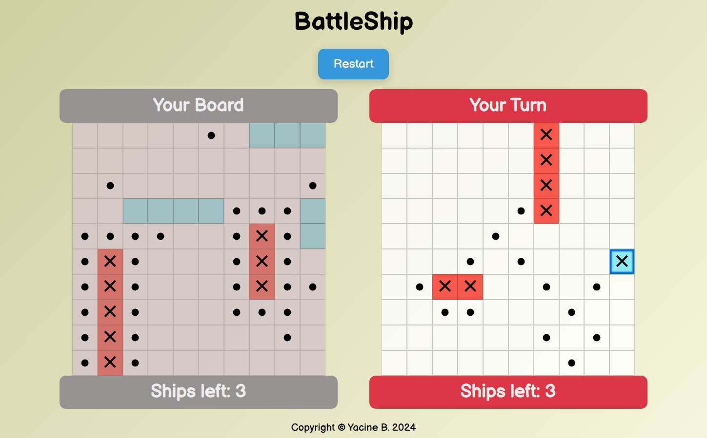
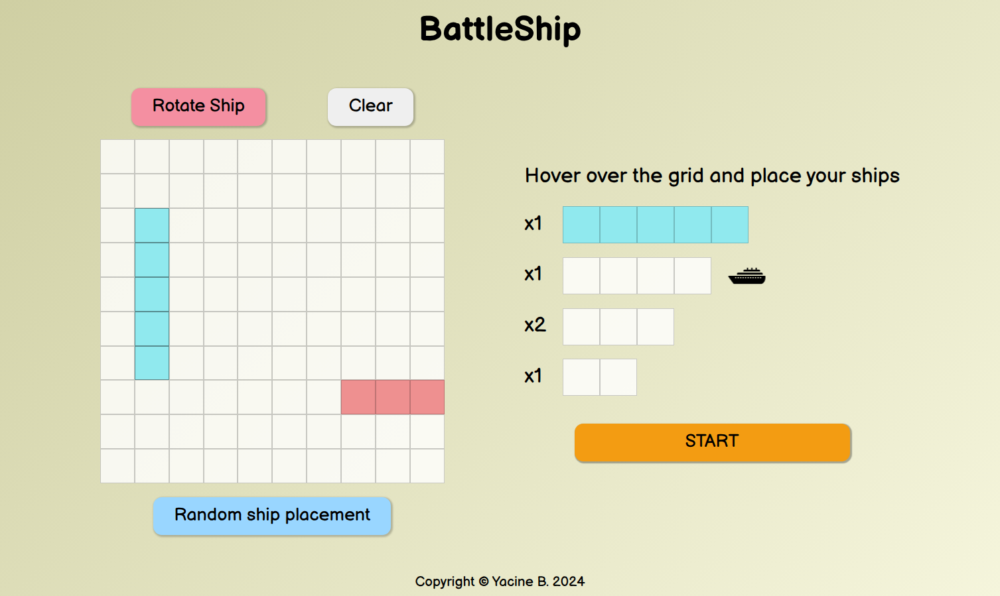

# Battleship

A classic single player Battleship game where the player tries to sink all of the computer's ships.



## Preparation Screen



# [Live Preview](https://3antozz.github.io/Battleship/)

## Why build this project ?

This was a project assignment from The Odin Project's Javascript course. The intention of this was to practice the basics of Test Driven Development.

## Features

- Interactive drag-and-drop ship placement on the grid.
- Dynamic UI showing player boards and status.
- Polished AI that plays similarly to humans.

## Technologies Used

- HTML
- Javascript
- CSS
- Webpack
- Jest

## 🛠️ How to Run the Project Locally

### Prerequisites

- [Node.js](https://nodejs.org/)
- [npm](https://www.npmjs.com/)

---

### 1. Clone the Repository

```bash
git https://github.com/3antozz/Battleship
cd Battleship
```

2- Start the server:

```bash
npm run dev
```
> [!NOTE]
> The server will run on http://localhost:8080 by default.

### 3. Open in Browser

1- Once the server is running:

2- Visit http://localhost:3000 in your browser

